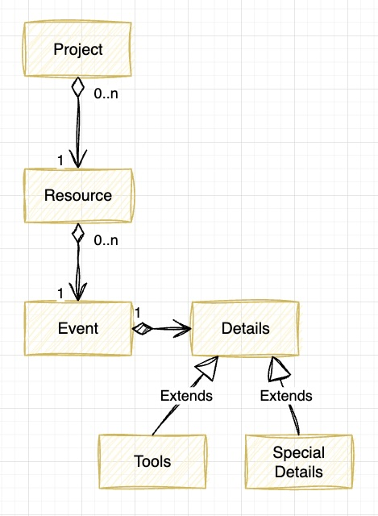

# .NET / C# - GraphQL Demo #

This project aims to show a GraphQL project can look like in .NET / C#.

The idea was some sort of resource planning, where you would like to expose an API and retrieve various information.

Think of it like this:


# The model #



# Run #
> dotnet run

# GraphQL Queries #

## Get all projects ##
```graphql
query first {
    allProjects {
      name
    }
}
```

should result in 
```json
{
  "data": {
    "allProjects": [
      {
        "name": "Avsås-Project"
      },
      {
        "name": "Köby-Project"
      },
      {
        "name": "Avsta-Project"
      },
  }
}
```

## get all projects with limited events ##

```graphql
query first {
    allProjects {
      name
      color
      resources {
        name
        events(from: "2023-10-01", limit: 2) {
          start
          days
          belongsToResource {
            name
            events {
              name
            }
          }
        }
      }
    }
}
```

should result in something like this

```json
{
  "data": {
    "allProjects": [
      {
        "name": "Avsås-Project",
        "color": "purpur",
        "resources": [
          {
            "name": "Wiley Andersson",
            "events": [
              {
                "start": "2023-10-26",
                "days": 2,
                "belongsToResource": {
                  "name": "Wiley Andersson",
                  "events": [
                    {
                      "name": "evt-0"
                    },
                    {
                      "name": "evt-1"
                    },
                    {
                      "name": "evt-2"
                    },
                    {
                      "name": "evt-3"
                    },
                    {
                      "name": "evt-4"
                    },
                    {
                      "name": "evt-5"
                    },
                    {
                      "name": "evt-6"
                    },
                    {
                      "name": "evt-7"
                    },
                    {
                      "name": "evt-8"
                    },
                    {
                      "name": "evt-9"
                    }
                  ]
                }
              },
              {
                "start": "2023-10-28",
                "days": 2,
                "belongsToResource": {
                  "name": "Wiley Andersson",
                  "events": [
                    {
                      "name": "evt-0"
                    },
                    {
                      "name": "evt-1"
                    },
                    {
                      "name": "evt-2"
                    },
                    {
                      "name": "evt-3"
                    },
                    {
                      "name": "evt-4"
                    },
                    {
                      "name": "evt-5"
                    },
                    {
                      "name": "evt-6"
                    },
                    {
                      "name": "evt-7"
                    },
                    {
                      "name": "evt-8"
                    },
                    {
                      "name": "evt-9"
                    }
                  ]
                }
              }
            ]
          }
        ]
      }
  }
}
```